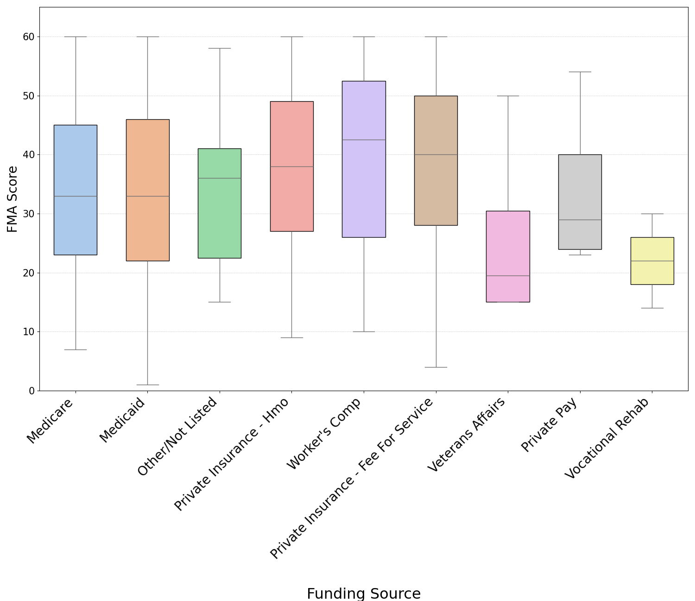

# Research @ tOSU Wexner Center  
**Data Analysis on Patient Outcomes in Assistive Technology**

---

## 📊 Overview

- Explored patient data from the Wheelchair Service Delivery process at OSU's Assistive Technology Clinic.
- Patient outcomes were measured using the **Functional Mobility Assessment (FMA)**, a self-report tool that ranges from 0–60 (higher = better outcome).
- Performed statistical analysis to investigate how **demographics and clinical factors** affect FMA scores.
- The goal was to highlight the impact of **seating and mobility equipment interventions** on patient outcomes.

---

## 🛠 Tools Used

- **Python**: `pandas`, `numpy`, `matplotlib`, `statsmodels`
- **Microsoft Excel**
- **Microsoft Word** (for documentation & summaries)

---

## 📈 Code and Results

### 🔹 Weight vs FMA Score

This plot displays the distribution of patient weights.  
A **Pearson correlation test** showed a negative relationship: as **weight increases**, FMA scores tend to **decrease**.

👉 [View Code](https://github.com/dchavan2192/Research-OSU-Wexner-Center-/blob/main/EmploymentCode.py)

---

### 🔹 Funding Source vs FMA Score

This boxplot shows FMA scores grouped by different **funding sources** (insurance types).  
Using **Tukey's HSD**, we concluded that patients with **public funding** generally had **lower FMA scores** than those with private insurance.

👉 [View Code](https://github.com/dchavan2192/Research-OSU-Wexner-Center-/blob/main/fundingSourceCode.py)

---

## 📄 Published Research

📌 **Presented at RESNA** (Rehabilitation Engineering and Assistive Technology Society of North America)  
📝 [View Paper – *Analysis of FMA Outcome Measures*](https://github.com/dchavan2192/Research-OSU-Wexner-Center-/blob/main/Analysis_of_FMA_outcome_measures.pdf)

---

## 🎤 RehabWeek 2025, Chicago

**RehabWeek** is a global research conference focused on assistive technology and rehabilitation.  
Over **2,000 researchers and clinicians** attended — our work was shared and well received!

🖼️ [View Poster](https://github.com/dchavan2192/Research-OSU-Wexner-Center-/blob/main/FMA%20Analysis%20Poster.pdf)  
*A visual summary presented to professionals in the field.*

---

Team photo in front of our poster at RehabWeek 2025!

---

