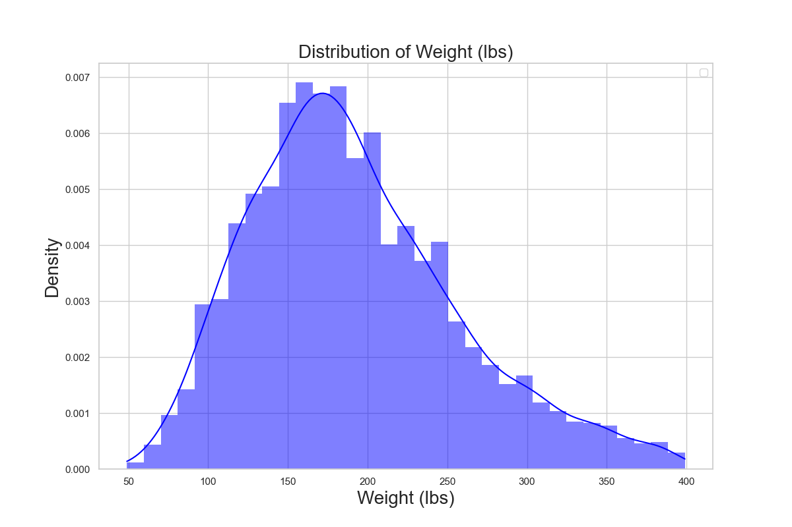

# Research @ tOSU Wexner Center: Data Analysis on patient outcomes in the field of assistvie technology
## Overview:
- Taking a look into the insights of patient data in the Wheelchair Service delivery process
- A way to measure patient outcomes is by using a performance-based self-report tool known as FMA (Functional Mobility Assessment)
- The FMA ranges from 0-60 where a higher score corresponds to a positve patient outcome
- Using patient data, I can perform a multitude of statistical tests comparing demographic data and how FMA plays a role
- This is all done to highlight the impact of seating and mobility equipment interventions performed at the Ohio State University Assistive Technology Clinic 

## Tools used for Data Analysis
- Python (Pandas, NumPy, Matplotlib, Statsmodels)
- Microsoft Excel 
- Microsoft Word

## Deeper Look into Code and Results

## Publication to RESNA (Rehabilitation Engineering and Assistve Technology Society of North America)

## Showcasing results at RehabWeek 2025 in Chicago!

